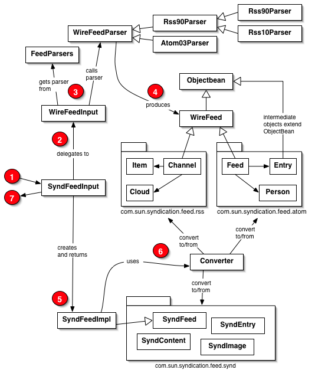

# Feed parsing

ROME is based around an idealized and abstract model of a Newsfeed, the
`SyndFeed` class. ROME is able to parse any RSS and Atom feed into this model
and to covert between the different formats.

Internally, ROME defines intermediate object models for specific Newsfeed
formats, or `WireFeed` formats, including both Atom and RSS variants. For each
format, there is a separate parser that parses XML into an intermediate model.
ROME provides `Converters` to convert between the intermediate `WireFeed` models
and the idealized `SyndFeed` model.

Here is what happens when ROME parses a feed:

1. Your code calls `SyndFeedInput` to parse a Newsfeed.
2. `SyndFeedInput` delegates to `WireFeedInput` to do the actual parsing.
3. `WireFeedInput` uses a PluginManager of class FeedParsers to pick the right
   parser to use to parse the feed and then calls that parser to parse the
   Newsfeed.
4. The appropriate parser parses the Newsfeed into a `WireFeed`. If the Newsfeed
   is in an RSS format, the `WireFeed` is of class `Channel`. If the Newsfeed is
   in Atom format, then the `WireFeed` is of class `Feed`. In the end,
   `WireFeedInput` returns a `WireFeed`.
5. `SyndFeedInput` uses the returned `WireFeedInput` to create a `SyndFeedImpl`.
   Which implements `SyndFeed`. `SyndFeed` is an interface, the root of an
   abstraction that represents a format independent Newsfeed.
6. `SyndFeedImpl` uses a Converter to convert between the format specific
   `WireFeed` representation and a format-independent `SyndFeed`.
7. `SyndFeedInput` returns a `SyndFeed` containing the parsed Newsfeed.

## Extensions

ROME supports extension for RSS 1.0, RSS 2.0 and Atom. Standard modules such as
Dublic Core and Syndication are supported and you can define your own custom
modules too.
